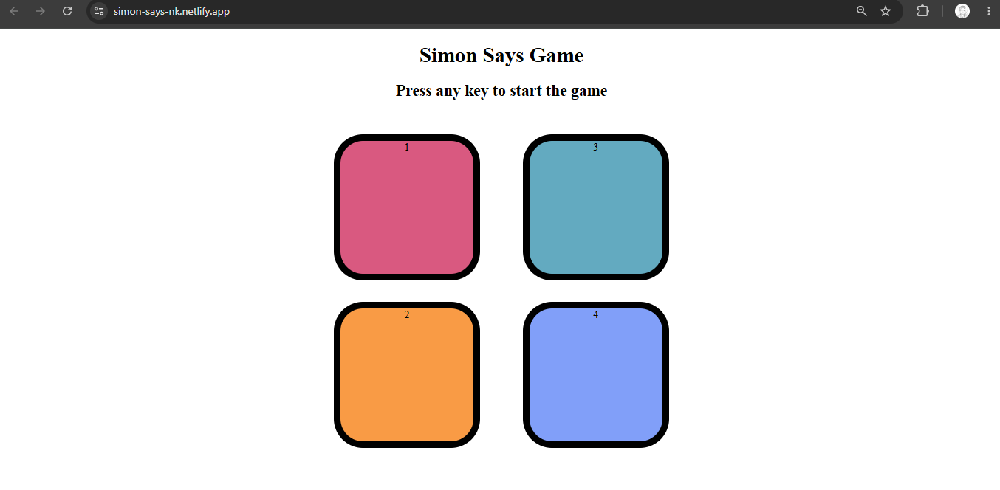
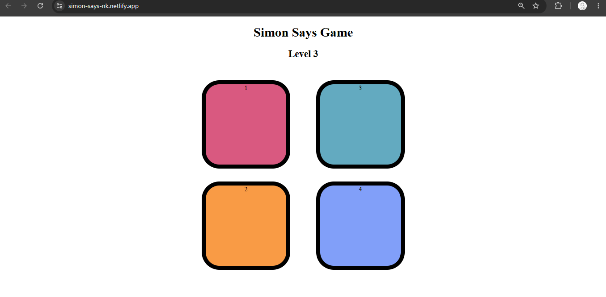

# Simon Says Game 🎮

A fun memory-based Simon Says game built using HTML, CSS, and JavaScript.
The game challenges users to remember and repeat the generated sequence.

## Features

- Interactive gameplay
- Dynamic sequence generation
- User input handling
- Score tracking
- Increasing difficulty level
- Responsive design

## Tech Stack

- HTML5
- CSS3
- JavaScript (DOM Manipulation)

## Project Highlights

- Implemented game logic using JavaScript
- Used DOM manipulation for dynamic UI updates
- Created an interactive user experience

## Screenshots

## Live Demo

https://simon-says-nk.netlify.app/

## GitHub Repository

https://github.com/Narendra-kushwaha/Simon-Says-Game

## 👨‍💻 Author

Narendra Kushwaha

